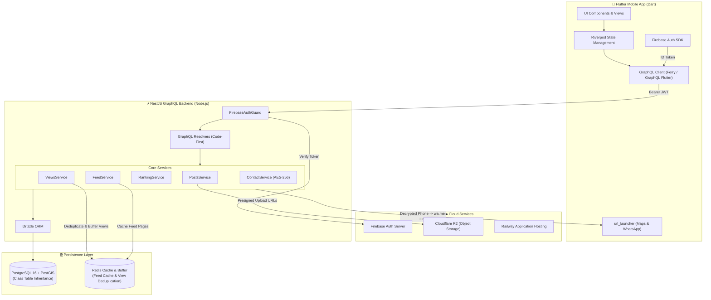
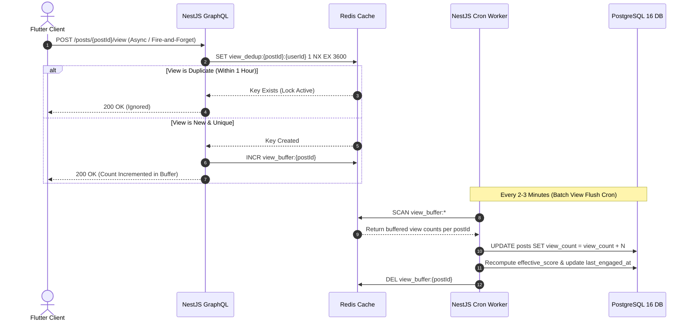

<div align="center">

# 🐾 Pubzy
### *Rescue. Adopt. Care.*

**Egypt’s premier mobile-first pet community ecosystem & emergency response platform.**

[](https://flutter.dev/)
[](https://nestjs.com/)
[](https://graphql.org/)
[](https://www.postgresql.org/)
[](https://postgis.net/)
[](https://orm.drizzle.team/)
[](https://redis.io/)
[](https://firebase.google.com/)
[](https://www.cloudflare.com/products/orca-r2/)
[](https://www.docker.com/)
[](https://railway.app/)

---

</div>

## 🎬 Project Overview & Video Demo

Pubzy is a modern, high-performance mobile application engineered to solve critical animal welfare challenges in Egypt. By combining **emergency rescue dispatching**, **lost & found reporting**, **responsible pet adoption matching**, and a **community pet marketplace**, Pubzy bridges the emotional and operational gap left by generic classified platforms like OLX or Dubizzle.

https://github.com/user-attachments/assets/final_pupzy.mp4

<div align="center">
  <video src="./final_pupzy.mp4" controls width="100%" style="border-radius: 12px; box-shadow: 0 8px 32px rgba(0,0,0,0.15);"></video>
  <p><em>🎥 Watch the full Pubzy Mobile Application walkthrough video above!</em></p>
</div>

---

## 🌟 Key Features & Verticals

Pubzy is built around four specialized verticals, each designed with tailored UX flows, spatial logic, and engagement mechanics:

```
                          ┌──────────────────────────────────────────┐
                          │               PUBZY PLATFORM             │
                          └────────────────────┬─────────────────────┘
                                               │
       ┌──────────────────┬────────────────────┴───────────────────┬──────────────────┐
       ▼                  ▼                                        ▼                  ▼
🚨 Emergency Help    🔍 Lost & Found                        🏠 Pet Adoption     🛒 Pet Marketplace
   Dispatch Board       Community Network                      Matchmaking         Classifieds Engine
```

### 🚨 1. Emergency Rescue Dispatch (`RESCUE`)
* **911-Style Dispatch Board**: High-priority real-time feed sorted strictly by urgency (`CRITICAL` → `URGENT` → `MODERATE`).
* **Coordination Signals**: Indicates reporter role (`REPORTING` - spotted & left, `ON_SITE` - waiting with animal, `CAN_TRANSPORT` - ready to move).
* **Live GPS Coordinates**: Returns exact PostGIS latitude/longitude with one-tap native Google Maps deep linking (`maps.google.com/?q={lat},{lng}`) via `url_launcher`.
* **Zero Expiry**: Rescue listings are never auto-removed until marked `RESOLVED`.

### 🔍 2. Lost & Found Network (`LOST`)
* **Dual-Direction Matching**: Unifies both `LOST_PET` (owners seeking lost pets) and `FOUND_STRAY` (citizens hosting or spotting strays).
* **Detailed Descriptors**: Filter by species, breed, color, markings, collar/ID tag, date last seen/found, and animal health condition.
* **Resolution Tracking**: Instant status toggles for `REUNITED` and `RESOLVED`.

### 🏠 3. Responsible Pet Adoption (`ADOPTION`)
* **Privacy-First Matching**: Owner contact details are protected behind a multi-step adoption application gate.
* **Smart Screening Questionnaire**: Evaluates living situation (apartment, yard, farm), prior experience, children/pet compatibility, vet references, and home visit consent.
* **Hot Score Ranking**: Reddit-inspired engagement algorithm surfaces active, highly-interacted adoption listings organically.

### 🛒 4. Community Pet Marketplace (`PRODUCT`)
* **Zero-Fee Classifieds**: Direct buyer-to-seller connections without middleman commission fees or cart friction.
* **Supplies & Care**: Categorized browsing for `CARE`, `FOOD`, `TRANSPORT`, `ACCESSORIES`, `GROOMING`, and `MEDICAL_SUPPLIES`.
* **Instant WhatsApp Link**: One-tap interaction generating encrypted `wa.me/` direct contact links dynamically.
* **View-Driven Ranking**: Driven by buyer activity signals with automated inactivity pruning after 14 days of zero views.

---

## 🏗️ System Architecture

Pubzy follows **Clean Architecture** and **Domain-Driven Design (DDD)** principles across both backend and mobile applications.



---

## 🧮 Feed Algorithms & Mathematical Models

To eliminate spam and manual "bumping" mechanics (e.g. OLX last-bumped mechanisms), Pubzy utilizes dynamic organic scoring with logarithmic time decay.

### 🔥 Adopt Feed (`effective_score`)
Surfaces adoption listings based on active community intent (upvotes, saves, and views):

$$\text{Score}_{\text{Adopt}} = \frac{3 \cdot \text{upvotes} + 2 \cdot \text{saves} + 0.1 \cdot \text{views} + 1}{(\text{age\_hours} + 2)^{1.5}}$$

* **Upvotes ($\times 3$) & Saves ($\times 2$)**: High-intent explicit community signals.
* **Views ($\times 0.1$)**: Low-weight passive traffic signal.
* **Time Decay ($(\text{age\_hours} + 2)^{1.5}$)**: Ensures fresh adoption posts gain visibility while older posts naturally decay unless backed by strong engagement.

### 📈 Marketplace Feed (`effective_score`)
Ranks product listings by buyer demand without upvote clutter:

$$\text{Score}_{\text{Market}} = \frac{1 \cdot \text{views} + 5 \cdot \text{saves} + 1}{(\text{age\_hours} + 2)^{1.5}}$$

* **Saves ($\times 5$)**: High-intent purchase bookmark signal.
* **Views ($\times 1$)**: Primary organic browsing metric.
* **Upvotes**: Disabled (`upvote_count` remains 0).

---

## ⚡ High-Throughput View Tracking (Redis Buffer)

Direct PostgreSQL database writes on every post view would create severe write bottlenecks under high traffic. Pubzy implements a high-performance **Redis-buffered view pipeline**:



---

## 🔐 Geolocation & Contact Privacy Architecture

### 📍 Spatial Privacy Matrix
| Post Type | Coordinate Exposure | Location Returned | Primary Action |
| :--- | :--- | :--- | :--- |
| **`RESCUE`** | **Full (Exact GPS)** | `{ latitude, longitude }` | Open in Google Maps (`maps.google.com/?q=lat,lng`) |
| **`LOST`** | **Full (Exact GPS)** | `{ latitude, longitude }` | Open in Google Maps (`maps.google.com/?q=lat,lng`) |
| **`ADOPTION`** | 🔒 **Masked** | `City Name + Distance (km)` | Submit Adoption Application Gate |
| **`PRODUCT`** | 🔒 **Masked** | `City Name + Distance (km)` | Request Contact / WhatsApp Link |

### 🔒 Phone Number Security (Zero-Storage Architecture)
1. **AES-256-GCM Encryption**: User phone numbers are stored strictly encrypted at rest inside PostgreSQL.
2. **On-The-Fly Decryption**: Phone numbers are decrypted only when an owner explicitly approves a contact request or application.
3. **Zero Storage Client-side**: The backend computes a formatted `wa.me/{phone}` URL dynamically at GraphQL query time. Raw numbers are never stored in client memory or exposed in feed payloads.

---

## 🗄️ Database Schema & Class Table Inheritance (CTI)

Pubzy utilizes **Class Table Inheritance (CTI)** in PostgreSQL to combine polymorphic feed performance with strong table-level type constraints.

```
                           ┌──────────────────────────────────────────┐
                           │               posts (Base)               │
                           ├──────────────────────────────────────────┤
                           │ id: uuid (PK)                            │
                           │ creator_id: uuid (FK -> users)           │
                           │ post_type: post_type (ENUM)              │
                           │ status: post_status (ENUM)               │
                           │ city_id: uuid (FK -> cities)             │
                           │ coordinates: geometry(POINT, 4326)      │
                           │ view_count / upvote_count / save_count   │
                           │ effective_score: float                   │
                           │ last_engaged_at: timestamptz             │
                           └────────────────────┬─────────────────────┘
                                                │ (1:1 Joined on Detail Screen Only)
       ┌──────────────────┬─────────────────────┴─────────────────────┬──────────────────┐
       ▼                  ▼                                           ▼                  ▼
┌──────────────┐   ┌──────────────┐                            ┌──────────────┐   ┌──────────────┐
│ rescue_posts │   │  lost_posts  │                            │adoption_posts│   │product_posts │
├──────────────┤   ├──────────────┤                            ├──────────────┤   ├──────────────┤
│ post_id (PK) │   │ post_id (PK) │                            │ post_id (PK) │   │ post_id (PK) │
│ species      │   │ report_type  │                            │ pet_name     │   │ category     │
│ condition    │   │ breed        │                            │ age_value    │   │ condition    │
│ reporter_role│   │ date_seen    │                            │ personality  │   │ price_amount │
└──────────────┘   └──────────────┘                            └──────────────┘   └──────────────┘
```

### ⚡ Optimized Indexing Strategy
* **Geospatial Queries**: PostGIS GIST Index on `posts.coordinates` for `ST_DWithin` spatial radius filtering.
* **Partial Feed Indexes**:
  * `idx_posts_help_feed`: `(city_id, post_type, urgency, created_at) WHERE status='ACTIVE' AND post_type IN ('RESCUE','LOST')`
  * `idx_posts_adopt_score`: `(city_id, effective_score, created_at) WHERE status='ACTIVE' AND post_type='ADOPTION'`
  * `idx_posts_market_score`: `(city_id, effective_score, created_at) WHERE status='ACTIVE' AND post_type='PRODUCT'`
  * `idx_posts_market_category`: `(city_id, market_category, effective_score) WHERE status='ACTIVE' AND post_type='PRODUCT'`
* **Automated Counter Triggers**: PostgreSQL trigger `user_post_count_trigger` automatically maintains all 5 user activity counters in sync across direct DB operations and AdminJS updates.

---

## 🛠️ Technology Stack Breakdown

| Layer | Technology | Purpose |
| :--- | :--- | :--- |
| **Mobile App** | **Flutter (Dart 3.x)** | Cross-platform iOS & Android application |
| **State Management** | **Riverpod 2.x** | Reactive state & dependency injection |
| **API Paradigm** | **GraphQL (Code-First NestJS)** | Strongly-typed API queries & mutations |
| **Backend Framework** | **NestJS (Node.js & TypeScript)** | Modular enterprise microservice backend |
| **ORM** | **Drizzle ORM** | Type-safe SQL query builder & migration engine |
| **Database** | **PostgreSQL 16 + PostGIS** | Relational data & spatial GIS indexing (SRID 4326) |
| **Cache & Buffer** | **Redis** | Feed cache, view deduplication & atomic view counters |
| **Authentication** | **Firebase Auth** | Social login (Google & Facebook) via FlutterFire |
| **Cloud Storage** | **Cloudflare R2** | Zero-egress S3-compatible image hosting via presigned URLs |
| **Deployment** | **Docker & Railway** | Containerized backend deployment & CI/CD pipeline |

---

## 🚀 Getting Started & Local Setup

### Prerequisites
* **Flutter SDK**: `>=3.19.0`
* **Node.js**: `>=20.x` & `npm`
* **Docker & Docker Compose** (for local Postgres & Redis)

### 1. Database & Cache Infrastructure
```bash
# Start PostgreSQL (with PostGIS extension) and Redis containers
docker run --name pupzy-postgres -e POSTGRES_DB=pupzy -e POSTGRES_USER=postgres -e POSTGRES_PASSWORD=postgres -p 5432:5432 -d postgis/postgis:16-3.4
docker run --name pupzy-redis -p 6379:6379 -d redis:alpine
```

### 2. Backend Setup (`NestJS`)
```bash
# Navigate to backend directory
cd backend

# Install dependencies
npm install

# Copy environment template
cp .env-example .env

# Run Drizzle DB migrations & seed city database
npm run db:push
npm run db:seed

# Start NestJS backend development server
npm run start:dev
```
The GraphQL Playground will be accessible at: `http://localhost:3000/graphql`.

### 3. Frontend Setup (`Flutter`)
```bash
# Navigate to frontend directory
cd frontend

# Get Flutter packages
flutter pub get

# Run on connected device or simulator
flutter run
```

---

## 📋 Naming Conventions & Code Quality Policy

Pubzy enforces a **Strict No-Abbreviations Policy** across all database columns, code symbols, GraphQL types, and variable names for long-term codebase maintainability:

| ❌ Forbidden Abbreviation | ✅ Mandatory Full Name |
| :--- | :--- |
| `name_en` / `name_ar` | `name_english` / `name_arabic` |
| `geom` / `center_geom` | `coordinates` / `center_point` |
| `firebase_uid` | `firebase_user_id` |
| `url` / `r2_key` | `public_url` / `cloudflare_storage_key` |
| `content_type` | `file_content_type` |
| `has_collar` | `has_collar_with_identification_tag` |

---

## 👥 Core Team & Credits

| Role | Contributor | Stack |
| :--- | :--- | :--- |
| **Backend & Architecture** | **Garma** | NestJS, PostgreSQL/PostGIS, Drizzle ORM, Redis, GraphQL |
| **Mobile Frontend** | **Matheo Mochles** | Flutter, Riverpod, Ferry, GraphQL |

---

<div align="center">

Made with ❤️ in Egypt for animal rescue & protection across the nation.

**[Pubzy — Rescue. Adopt. Care. 🐾]**

</div>
