# Pubzy — Complete System Flowcharts

> Every section of the platform, diagrammed end-to-end.
> Each flow maps to specific DB tables, GraphQL operations, and the implementation phase it belongs to.

---

## 1. High-Level System Architecture

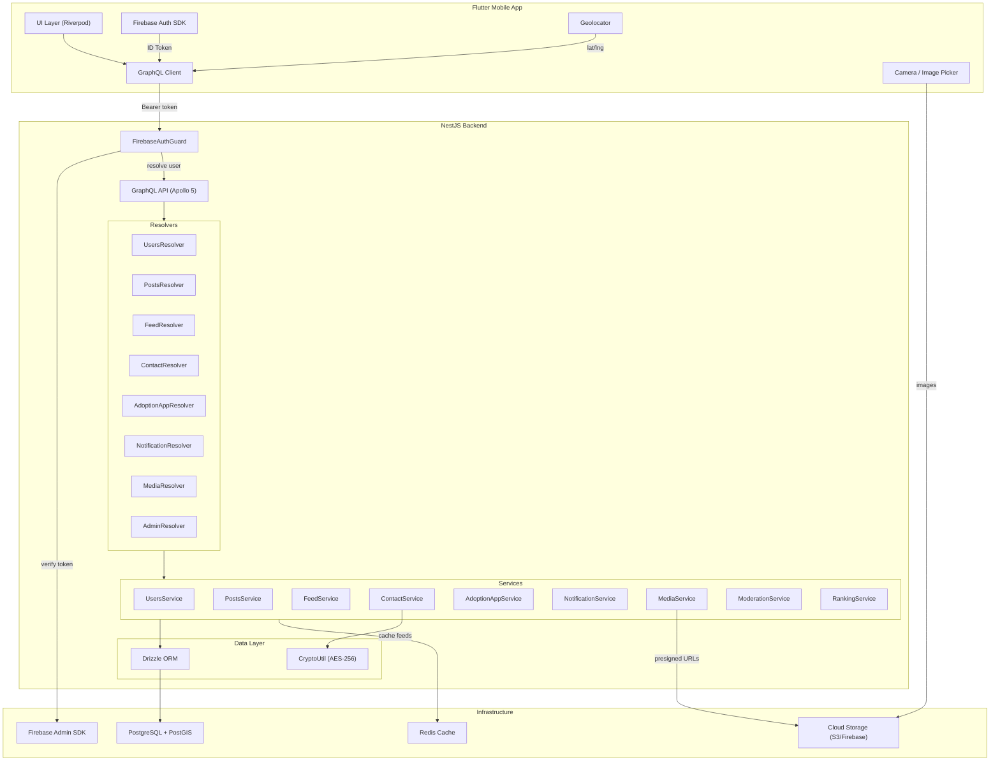

---

## 2. Authentication & Profile Flow

> **Phase:** 1 · **Tables:** `users`, `cities` · **Operations:** `me`, `completeProfile`, `updateProfile`, `updateMyLocation`

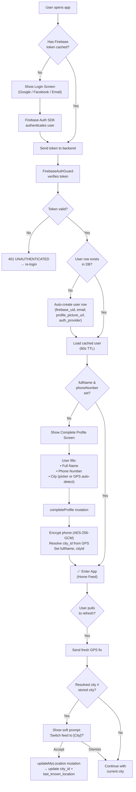

---

## 3. Post Creation Engine

> **Phase:** 2 · **Tables:** `posts`, `post_media`, `post_locations`, + extension tables · **Operations:** `createRescuePost`, `createLostPost`, `createFoundPost`, `createAdoptionPost`, `createProductPost`

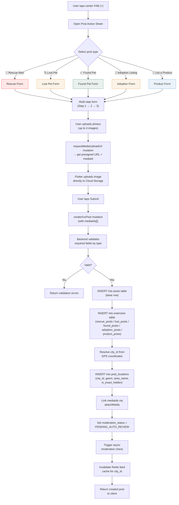

### Required Fields by Post Type

| Field | Rescue | Lost | Found | Adoption | Product |
|-------|--------|------|-------|----------|---------|
| title, description | ✅ | ✅ | ✅ | ✅ | ✅ |
| species | ✅ | ✅ | ✅ | ✅ | — |
| urgency | ✅ | optional | optional | — | — |
| condition/conditionSummary | ✅ | — | ✅ | — | ✅ |
| reporterRole | ✅ | — | — | — | — |
| petName | — | optional | — | ✅ | — |
| gender | — | — | — | ✅ | — |
| vaccinated/neutered/microchipped | — | — | — | ✅ | — |
| dateLastSeen | — | ✅ | — | — | — |
| dateFound | — | — | ✅ | — | — |
| category | — | — | — | — | ✅ |
| price/isFree | — | — | — | — | ✅ |
| cityId + location (GPS) | ✅ | ✅ | ✅ | ✅ | ✅ |
| mediaIds (≥1 photo) | ✅ | ✅ | ✅ | ✅ | ✅ |

---

## 4. Home Feed (Composite)

> **Phase:** 3 · **Tables:** `posts`, `post_locations`, `rescue_posts`, `adoption_posts` · **Operation:** `homeFeed`

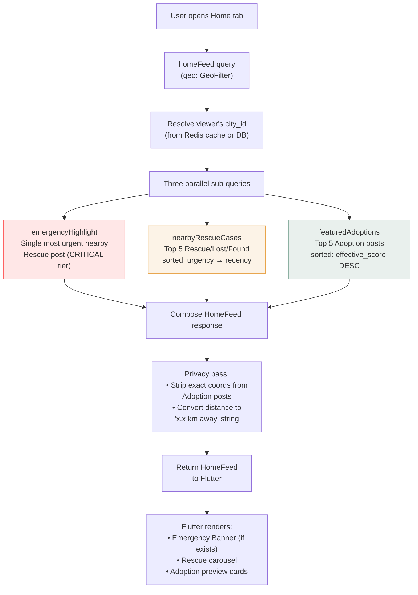

---

## 5. Help Feed (Rescue + Lost & Found)

> **Phase:** 3 · **Feels like:** 911 Dispatch Board
> **Sort:** Urgency tier → Recency → Engagement (tiebreak only)

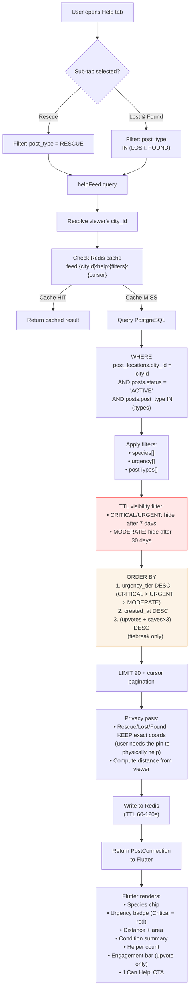

### Help Feed Ranking Logic (Pseudocode)

```
-- Primary: urgency tier (CRITICAL always above URGENT, always above MODERATE)
-- Secondary: newest first within each tier
-- Tertiary: engagement tiebreak for near-identical timestamps

SELECT p.*, pl.geom, pl.city_id,
       CASE p.urgency
         WHEN 'CRITICAL' THEN 3
         WHEN 'URGENT'   THEN 2
         WHEN 'MODERATE'  THEN 1
       END AS urgency_rank
FROM posts p
JOIN post_locations pl ON pl.post_id = p.id
WHERE pl.city_id = :cityId
  AND p.status = 'ACTIVE'
  AND p.post_type IN ('RESCUE','LOST','FOUND')
  -- TTL filter
  AND (
    (p.urgency IN ('CRITICAL','URGENT') AND p.created_at > NOW() - INTERVAL '7 days')
    OR (p.urgency = 'MODERATE' AND p.created_at > NOW() - INTERVAL '30 days')
    OR p.urgency IS NULL
  )
ORDER BY urgency_rank DESC,
         p.created_at DESC,
         (p.upvote_count + p.save_count * 3) DESC
LIMIT 20;
```

---

## 6. Adopt Feed

> **Phase:** 3 · **Feels like:** Reddit "Hot"
> **Sort modes:** HOT (decayed score) or NEWEST

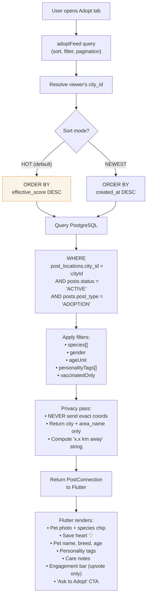

### Score Computation (Background Job or Trigger)

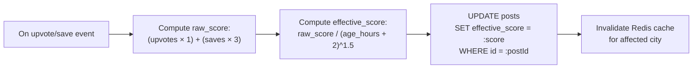

> [!TIP]
> `effective_score` can be recomputed periodically (every 5-15 min via cron) rather than on every vote, since the decay component changes over time regardless of new votes.

---

## 7. Market Feed

> **Phase:** 3 · **Feels like:** OLX / Dubizzle
> **Sort:** Recency (with bump), no voting

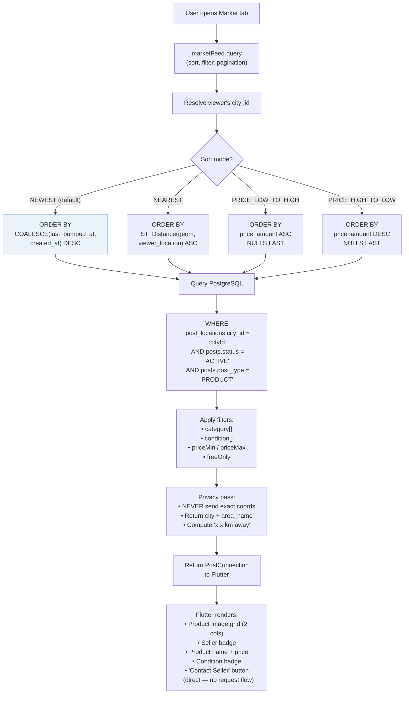

### Seller Bump Flow

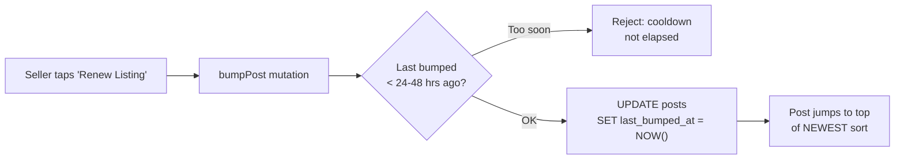

---

## 8. Contact Request Flow (WhatsApp Gateway)

> **Phase:** 4 · **Tables:** `contact_requests`, `notifications` · **Applies to:** Rescue, Lost, Found, Adoption (NOT Product)

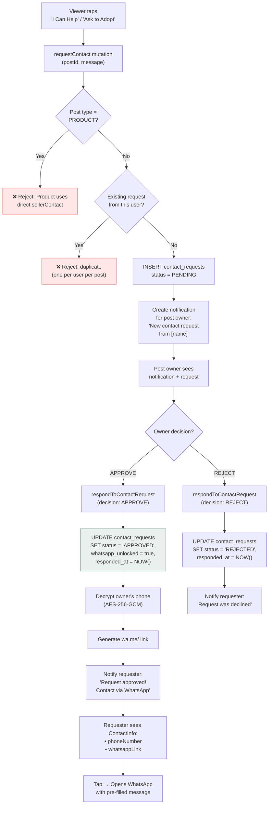

### Product Contact (No Request Flow)

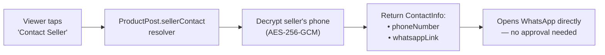

---

## 9. Adoption Application Flow (Responsible Matching)

> **Phase:** 4 · **Tables:** `adoption_applications`, `notifications` · **Operation:** `submitAdoptionApplication`, `reviewAdoptionApplication`

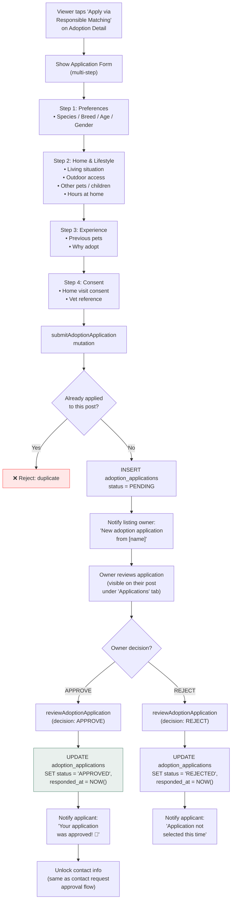

---

## 10. Upvote & Save Flow

> **Phase:** 2 · **Tables:** `post_upvotes`, `post_saves`, `posts` (denormalized counts)

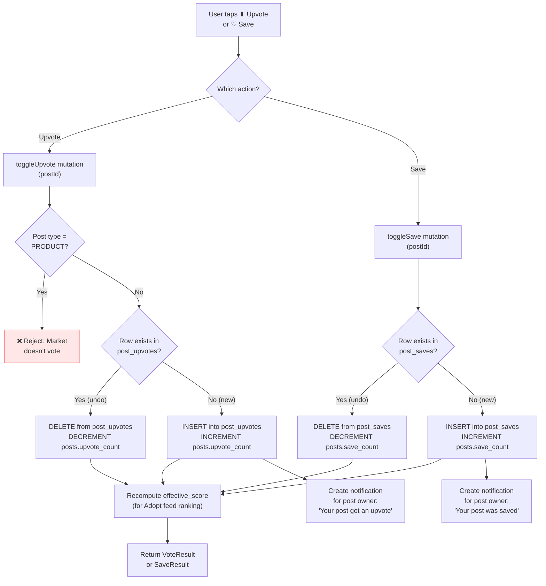

---

## 11. Media Upload Flow

> **Phase:** 2 · **Tables:** `post_media` · **Pattern:** Presigned URL (client uploads directly to storage)

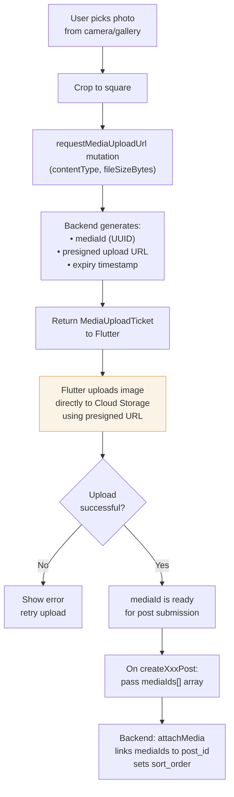

> [!IMPORTANT]
> The client never sends image bytes through GraphQL. Images go directly to Cloud Storage via presigned URL. Only the `mediaId` reference passes through the API — this keeps the GraphQL payload small and fast.

---

## 12. Notification Engine

> **Phase:** 5 · **Tables:** `notifications` · **Operations:** `notifications`, `unreadNotificationCount`, `markNotificationRead`, `markAllNotificationsRead`, `notificationReceived` (subscription)

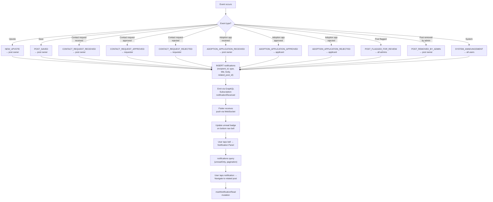

---

## 13. Content Moderation Pipeline

> **Phase:** 5 · **Tables:** `posts`, `post_reports`, `notifications` · **Operations:** `reportPost`, `clearModerationFlag`, `adminRemovePost`, `flaggedPosts`

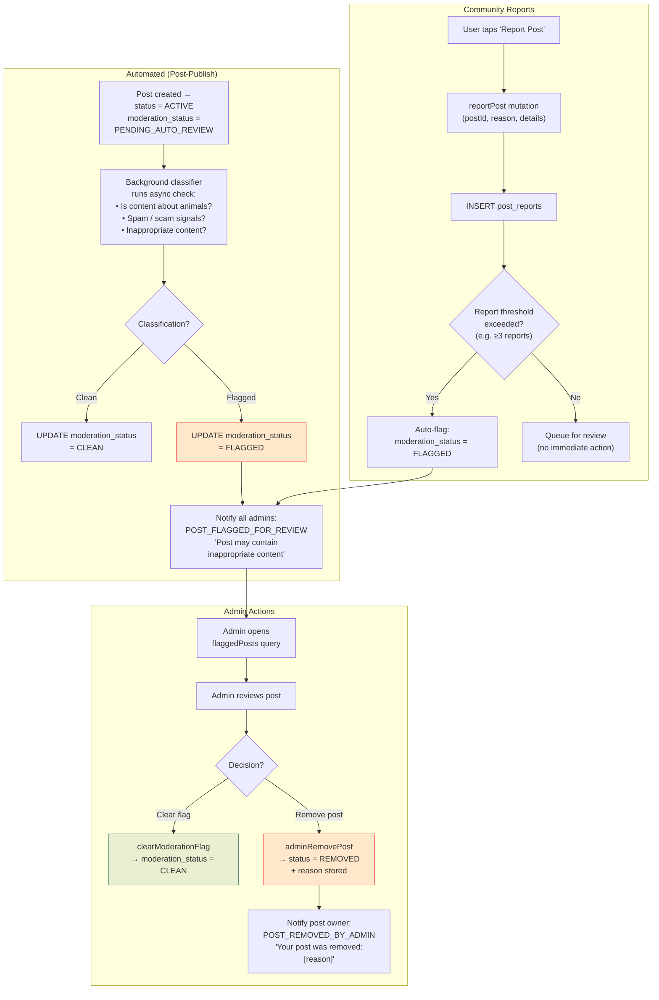

---

## 14. Implementation Dependency Graph & Phase Order

> This is the build sequence — each phase depends on the ones above it.

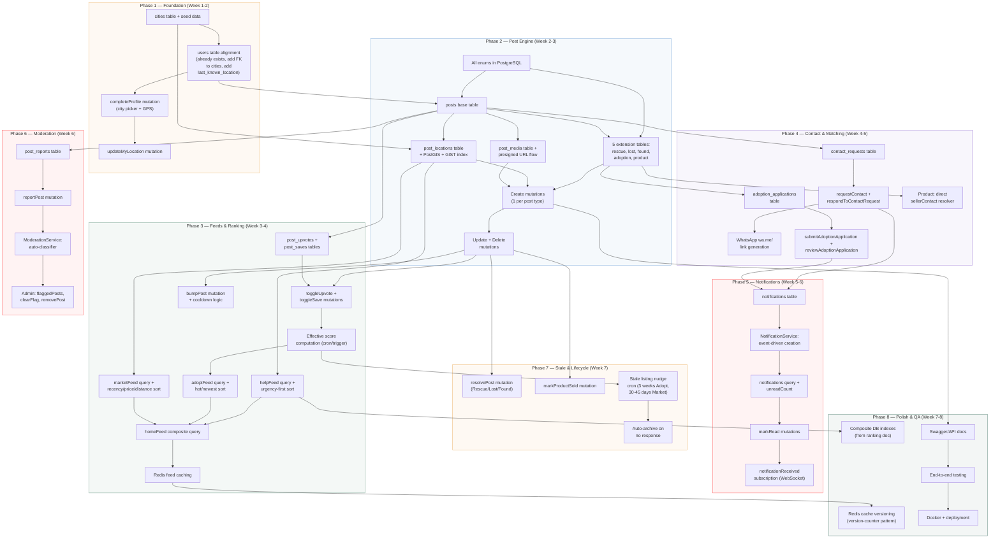

---

## Phase Summary Table

| Phase | What | Duration | Depends On | DB Tables |
|-------|------|----------|------------|-----------|
| **1** | Foundation | Week 1-2 | — | `cities`, `users` (update) |
| **2** | Post Engine | Week 2-3 | Phase 1 | `posts`, 5 extension tables, `post_locations`, `post_media` |
| **3** | Feeds & Ranking | Week 3-4 | Phase 2 | `post_upvotes`, `post_saves` |
| **4** | Contact & Matching | Week 4-5 | Phase 2 | `contact_requests`, `adoption_applications` |
| **5** | Notifications | Week 5-6 | Phase 4 | `notifications` |
| **6** | Moderation | Week 6 | Phase 2 | `post_reports` |
| **7** | Lifecycle | Week 7 | Phase 3 | — (logic only) |
| **8** | Polish & QA | Week 7-8 | All | — (indexes, caching, docs) |

> [!IMPORTANT]
> **Phases 3-4 can run in parallel** since feeds and contact/matching are independent modules that both depend only on Phase 2. Similarly, **Phases 6-7 can run in parallel** with Phase 5.
